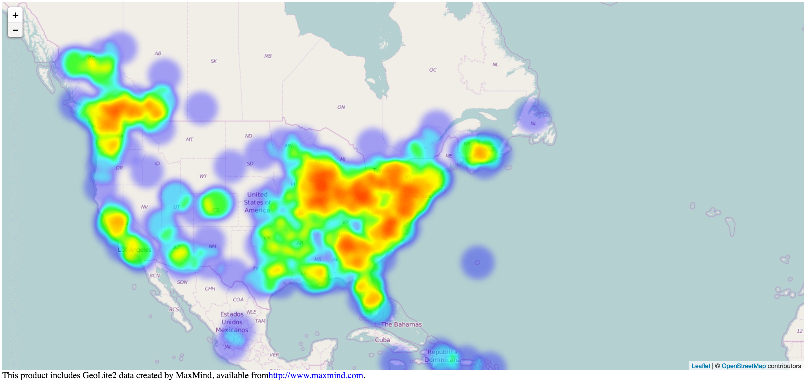

# ipv6-heat-map
A heat map representation of IPv6 Addresses.  GeoLite2 data is parsed and formatted into coarse and fine collections of IPs and stored in a Mongo Geospatial index.  The map is powered by React/Redux.

### Demo
You can see a demo [here](http://107.170.40.122/).

### Requirements
1. A locally running [Mongodb](https://docs.mongodb.com/manual/installation/) server
2. [Node.js 6.x](https://nodejs.org/en/download/)
3. [Git LFS](https://git-lfs.github.com/) for downloading the GeoLite2 csv

### Setup
1.  Clone the project: `git clone git@github.com:ZeroMcMuffin/ipv6-heat-map.git`
2.  Install the project dependencies: `cd ipv6-heat-map && npm install`
3.  Massage the csv and populate Mongo:  `node scripts/initialize.js`
4.  Start the server:  `node server.js`

### GeoLite2 
This project includes GeoLite2 data created by MaxMind, available from [http://www.maxmind.com](http://www.maxmind.com).

